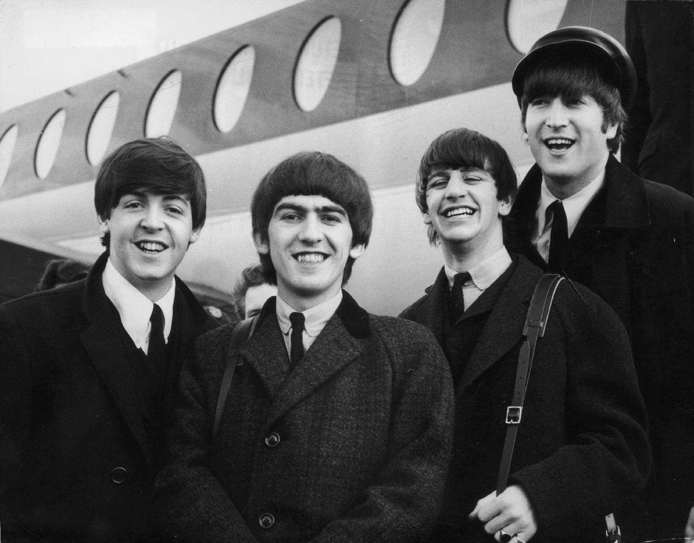
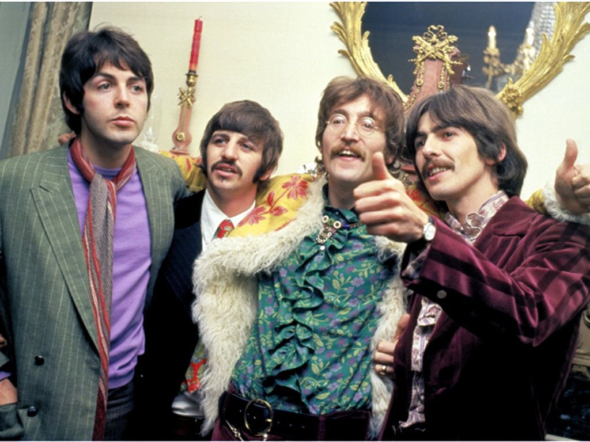

# Beatles Songs - Classification

Os Beatles são definitivamente a coisa mais importante que aconteceu para a música popular até hoje. Eles ficaram marcados nos seus primeiros anos por suas músicas mais "dançantes" como os rocks dos anos 50, letras românticas e arranjos musicais simples, esta era deles é comumente chamada como **"Yeah-yeahs"**. 
Porém ao longo da carreira da banda, eles foram amadurecendo musicalmente e passando por uma forte transição no que eram suas composições, esta transição começou no álbum "Rubber Soul", mas se deu definitivamente no **"Revolver"**, álbum este que revolucionou a indústria musical à época. A partir do Revolver os Beatles se caracterizaram por letras de caráter mais existencial, musicas mais lentas, arranjos mais complexos e um experimentalismo vanguardista. Como ícones da contracultura e por consequência do que viria se tornar a cultura "hippie", devido a isso, ao nível de produção revolucionário e ao experimentalismo extremo, esta era ficou conhecida como a era da **"Revolução Musical"**.

Um algoritmo de *Machine Learning* poderia identificar a que fase uma música dos Beatles pertence, baseado em suas características extraídas da plataforma de *streaming* Spotify?

###  Fase "Yeah-Yeahs"

### Fase "Musical Revolution"

